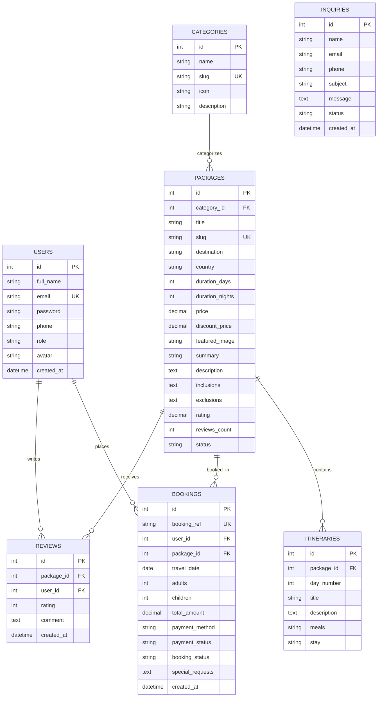
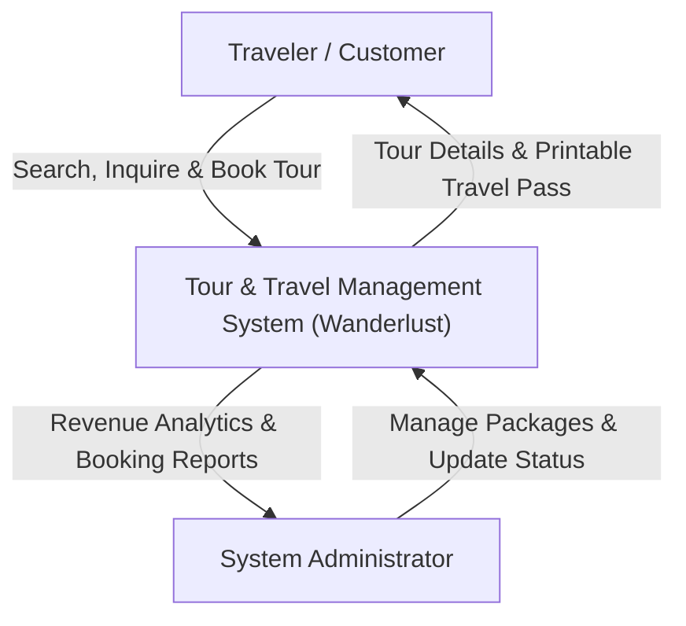
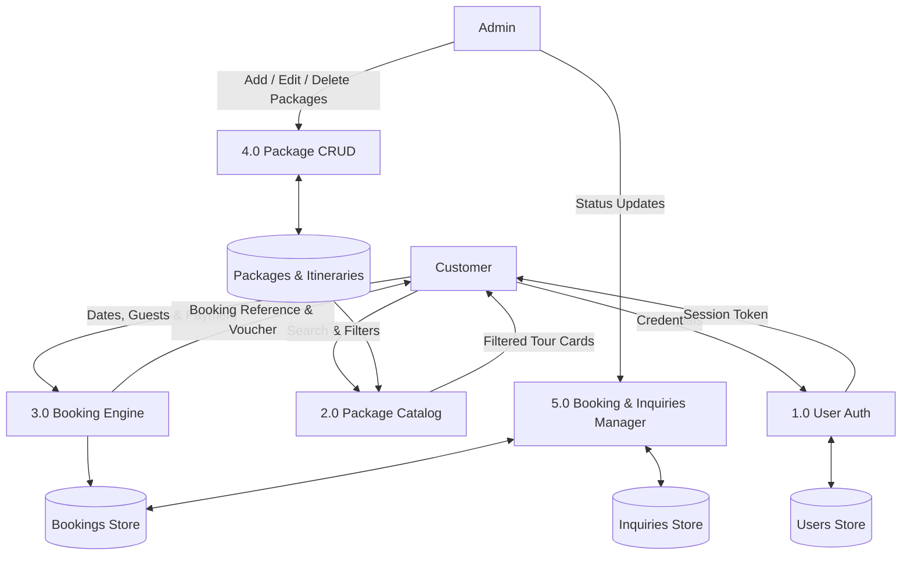

# 📄 Project Documentation & Academic Report

# Wanderlust - Tour & Travel Management System

---

## 1. Abstract

The **Wanderlust Tour & Travel Management System** is a web-based platform designed to automate and streamline the end-to-end operations of modern tourism businesses. Developed utilizing **HTML5, CSS3, Vanilla JavaScript, and PHP with MySQL (PDO)**, the application delivers an intuitive, visually stunning experience for travelers while providing comprehensive administrative oversight for tour organizers.

Key functional capabilities include live multi-criteria package search and filtering, day-by-day interactive itinerary discovery, automated booking calculations with tax and custom add-on modeling, dynamic receipt generation with QR-stamped travel passes, and an administrative control suite with visual revenue analytics and package CRUD controls.

---

## 2. Problem Statement & Scope

### 2.1 Existing System Limitations

- Traditional travel booking often involves manual email or phone communications, resulting in delayed confirmations and pricing discrepancies.
- Fragmented itinerary presentations make it difficult for customers to visualize day-to-day schedules, meals, and accommodations.
- Lack of centralized administrative consoles leads to booking mismanagement and untracked customer inquiries.

### 2.2 Proposed Solution Scope

- **Online Tour Discovery**: Search, filter by budget and duration, and view high-resolution imagery.
- **Transparent Itinerary Modeling**: Clear day-wise timeline with meal and accommodation breakdowns.
- **Automated Multi-Step Checkout**: Real-time price breakdown (Adults, Children discount, Taxes, Add-ons) and simulated payment confirmation.
- **Customer Self-Service**: Customer dashboard to inspect reservation status and print travel vouchers.
- **Administrative Control**: Analytics dashboard, tour package CRUD, booking status modulation, and inquiry inbox.

---

## 3. System Requirements

### 3.1 Hardware Requirements

- **Processor**: Intel Core i3 / AMD Ryzen 3 or higher (or Apple Silicon M-series)
- **RAM**: Minimum 2 GB (4 GB recommended)
- **Storage**: 200 MB free hard drive space

### 3.2 Software Requirements

- **Operating System**: Windows 10/11, macOS, or Linux
- **Web Server**: Apache / Nginx (or built-in PHP development server)
- **Programming Language**: PHP 7.4 or PHP 8.x
- **Database**: MySQL 5.7+ / MariaDB 10.3+ (or SQLite 3)
- **Web Browser**: Google Chrome, Mozilla Firefox, Microsoft Edge, Safari

---

## 4. Entity-Relationship (ER) Diagram & Database Design

### 4.1 ER Conceptual Model

---

## 5. Data Flow Diagrams (DFD)

### 5.1 Level 0 DFD (Context Level)

### 5.2 Level 1 DFD (Detailed Data Flow)

---

## 6. Testing & Quality Assurance

| Test Case ID    | Test Scenario         | Input Data                                                | Expected Result                                               | Status         |
| --------------- | --------------------- | --------------------------------------------------------- | ------------------------------------------------------------- | -------------- |
| **TC-01** | User Registration     | Valid Name, Email, Password (>=6 chars)                   | Account created, session started, redirect to portal          | **PASS** |
| **TC-02** | User Login            | `alex@example.com`, `user123`                         | Authentication verified via`password_verify()`, session set | **PASS** |
| **TC-03** | Invalid Login Attempt | `wrong@example.com`, `invalid`                        | Error toast displayed: "Invalid email address or password"    | **PASS** |
| **TC-04** | Live Keyword Search   | Keyword: "Bali"                                           | Displays Bali tour card, hides non-matching cards             | **PASS** |
| **TC-05** | Category Filter       | Click "Mountain & Trekking"                               | Shows Swiss Alps tour card exclusively                        | **PASS** |
| **TC-06** | Price Calculation     | 2 Adults + 1 Child (25% off) + Insurance (₹2,500/person) | Correct subtotal + 5% taxes + add-ons calculated dynamically  | **PASS** |
| **TC-07** | Booking Submission    | Date selected, payment simulated                          | Unique`WL-2026-XXXX` generated, voucher displayed           | **PASS** |
| **TC-08** | Customer Dashboard    | Logged-in customer visits`my-bookings.php`              | Renders user's bookings with printable pass button            | **PASS** |
| **TC-09** | Admin Auth Check      | Visit`admin/index.php` as customer                      | Restricts unauthorized access                                 | **PASS** |
| **TC-10** | Admin Package CRUD    | Create new tour package via modal                         | Record inserted in MySQL database and displayed in catalog    | **PASS** |
| **TC-11** | Booking Status Update | Admin changes status from Confirmed to Cancelled          | Status updated live via AJAX without page reload              | **PASS** |
| **TC-12** | Contact Inquiry Form  | Name, Email, Subject, Message submitted                   | Record stored in`inquiries` table, success toast shown      | **PASS** |

---

## 7. Conclusion & Future Enhancements

The Wanderlust Tour & Travel Management System achieves all core requirements set forward for modern, reliable travel operations. Built with pure HTML5, CSS3, JavaScript, and PHP/MySQL, it delivers high performance, robust security, and an engaging user experience.

### Future Scope:

- Integration with real-time flight and hotel GDS APIs (Amadeus / Sabre).
- Multi-currency live conversion with automated foreign exchange rates.
- AI-assisted itinerary generator based on user preferences and budget.
