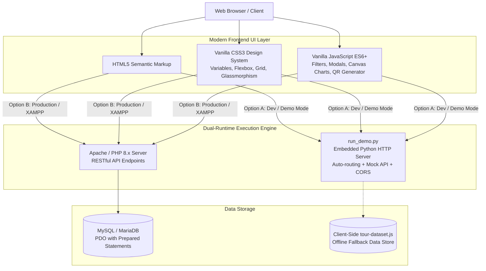
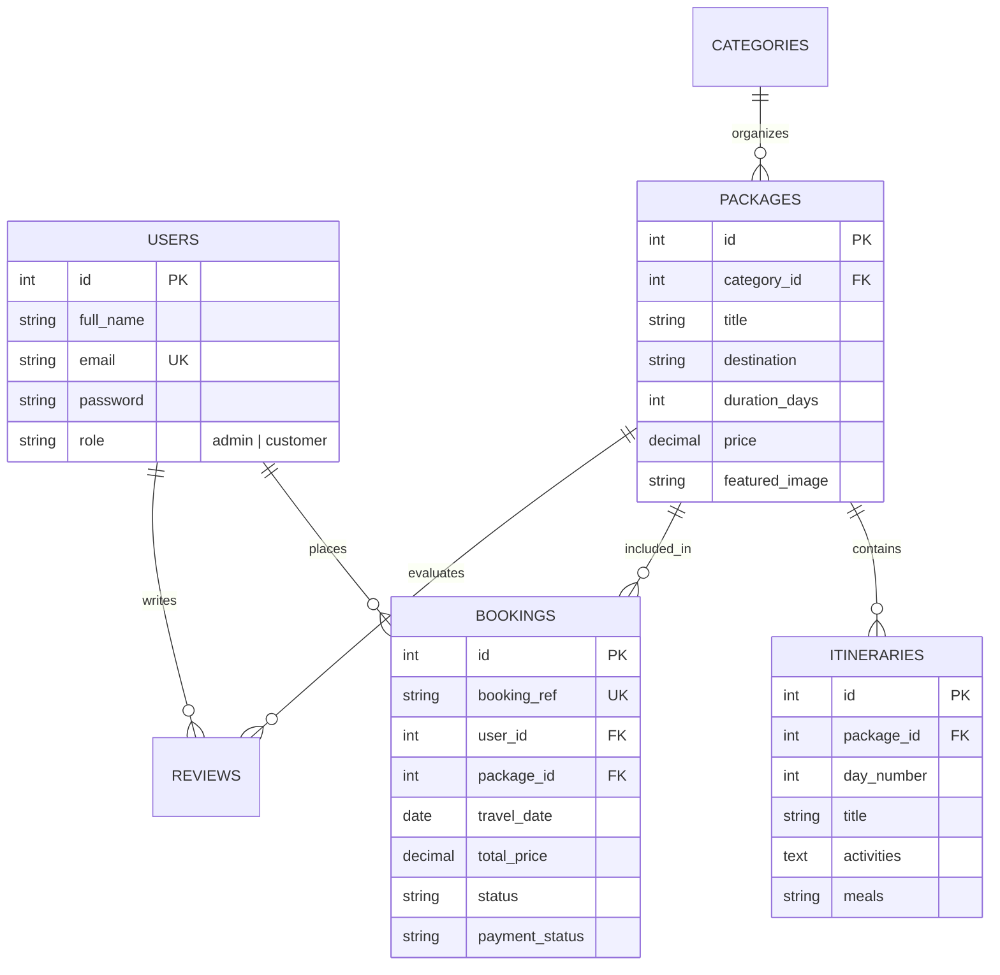

# 🕸️ SpidyWeb Tours & Travels - Tour & Travel Management System

[](#-how-to-run--demo-the-project)
[](#-system-architecture--tech-stack)
[](#-frontend-design--user-experience)
[](#-database-design--er-model)

> A full-stack, enterprise-grade travel discovery, booking, and management web application. Features 16 curated domestic & international destination stacks, day-by-day interactive itinerary discovery, automated booking calculations in Indian Rupees (₹), printable QR-stamped travel passes, and a comprehensive Administrative Control Center with real-time analytics.

---

## 📑 Table of Contents
1. [🌟 Project Overview & The Elevator Pitch](#-project-overview--the-elevator-pitch)
2. [✨ Key Features & Capabilities](#-key-features--capabilities)
   - [Customer Experience](#1-customer-facing-features)
   - [Administrative Control Center](#2-administrative-suite)
3. [🛠️ System Architecture & Tech Stack](#️-system-architecture--tech-stack)
4. [🚀 How to Run & Demo the Project](#-how-to-run--demo-the-project)
   - [Method 1: One-Click Python Runner (Zero Config)](#method-1-one-click-python-runner-zero-config--recommended)
   - [Method 2: XAMPP / WAMP / Apache + MySQL](#method-2-xampp--wamp--apache--mysql-full-php-stack)
   - [Method 3: PHP Built-in Server](#method-3-php-built-in-server)
5. [🔑 Demo Accounts & Credentials](#-demo-accounts--credentials)
6. [🎬 Step-by-Step Demonstration Flow](#-step-by-step-demonstration-flow)
7. [📁 Project Directory & File Map](#-project-directory--file-map)
8. [📊 Database Design & Schema](#-database-design--schema)
9. [💡 Viva, Presentation & Interview Talking Points](#-viva-presentation--interview-talking-points)
10. [🔒 Security & Best Practices](#-security--best-practices)

---

## 🌟 Project Overview & The Elevator Pitch

### What is SpidyWeb Tours & Travels?
**SpidyWeb** is an all-in-one Tour and Travel Management System built to replace fragmented, manual vacation planning with a sleek, modern digital experience. It addresses the common pain points of traditional travel booking:
* Lack of day-wise schedule transparency
* Hidden costs and confusing currency conversions
* Delayed manual booking confirmations
* Missing centralized tools for travel agencies to monitor bookings and revenue

### How to Explain This Project in 30 Seconds:
> *"SpidyWeb is a full-stack tour management platform with dual-runtime flexibility. On the customer side, travelers can browse 16 iconic destinations across India and the globe, filter by season or budget in Indian Rupees (₹), review interactive day-by-day itineraries, complete a multi-step reservation, and instantly generate printable QR-stamped boarding vouchers. On the business side, administrators get a dedicated control suite with HTML5 canvas analytics, booking status verifiers, customer inquiry inboxes, and package CRUD management."*

---

## ✨ Key Features & Capabilities

### 1. Customer-Facing Features
* **16 Curated Destination Stacks**: Covers domestic icons (*Kerala, Kashmir, Ladakh, Goa, Manali, Rajasthan, Andaman, Rishikesh, Darjeeling, Meghalaya, Ooty, Varanasi*) and global gateways (*Bali, Dubai, Swiss Alps*).
* **Multi-Criteria Search & Filter Engine**:
  * Real-time search by destination name or keywords.
  * Interactive **Season Dropdown** (Spring/Summer, Monsoon Greens, Festive Autumn, Winter Snow & Sun).
  * Category quick-chips (Honeymoon, Adventure, Heritage, Luxury, Beach, Wildlife).
  * Budget slider with live price filtering in Indian Rupees (**₹**).
* **MakeMyTrip-Style Date & Duration Picker**: Quick calendar selection for departure dates and trip durations.
* **Interactive Itinerary & Details Page**:
  * Visual day-by-day timeline with daily themes, meals, and accommodations.
  * Inclusions and Exclusions checklist.
  * Photo gallery and customer review ratings.
* **Smart Multi-Step Checkout Modal**:
  * Dynamic price calculator: Base fare + Adult multiplier + Child discount (50%) + GST (5%) + Optional add-ons (Airport Transfer, Travel Insurance, Candlelight Dinner).
  * Live discount coupon codes.
* **Instant Travel Pass / Boarding Voucher**:
  * Generates a printable pass with a dynamic **QR code**, booking reference number (e.g., `SPY-2026-8821`), passenger manifest, and date stamps.
* **Customer Dashboard (`my-bookings.html`)**:
  * View upcoming, completed, and pending trips.
  * Self-service booking cancellation with instant status update.
  * Download/re-print vouchers at any time.

### 2. Administrative Suite (`/admin`)
* **Executive Analytics Dashboard**:
  * High-level KPI cards: Total Bookings, Gross Revenue (₹), Registered Customers, Active Tour Packages.
  * Custom **HTML5 Canvas charts**: Monthly Revenue Trends and Category Booking Distribution.
* **Package Management (Full CRUD)**:
  * Add new tour packages with photos, pricing, duration, inclusions, and itineraries.
  * Edit existing packages or toggle status (`active` / `inactive`).
* **Booking Verification & Status Management**:
  * Real-time booking feed with status controls (`Pending` $\rightarrow$ `Confirmed` $\rightarrow$ `Cancelled`).
  * Payment status badge controls (`Paid`, `Pending`, `Refunded`).
* **Customer Inquiries Inbox**:
  * Track messages sent via the contact form with one-click reply actions.

---

## 🛠️ System Architecture & Tech Stack



### Technology Breakdown
| Layer | Technologies | Highlights |
|---|---|---|
| **Frontend** | HTML5, CSS3, Vanilla JavaScript (ES6+) | Zero external framework dependencies, instant load speeds, responsive across desktop, tablet, and mobile. |
| **Typography & Icons** | Outfit, Plus Jakarta Sans, JetBrains Mono, FontAwesome 6 | Curated typography hierarchy for high-end travel aesthetics. |
| **Backend (Option A)** | Python 3 (`http.server` & `socketserver`) | Zero-configuration local runner with automatic PHP-to-HTML fallback routing and mock API responses. |
| **Backend (Option B)** | PHP 7.4+ / 8.x (Vanilla PDO) | Secure REST-like API endpoints with JSON responses, input sanitization, and session control. |
| **Database** | MySQL 5.7+ / MariaDB | Relational schema with foreign keys, indexes, and ready-to-use seed records. |

---

## 🚀 How to Run & Demo the Project

### Method 1: One-Click Python Runner (Zero Config - Recommended)
No need to install Apache, PHP, or MySQL! The project includes an intelligent Python server (`run_demo.py`) that serves the static HTML/CSS/JS frontend, maps requests, mocks backend APIs, and automatically opens your browser.

```bash
# 1. Open Terminal inside the project folder:
cd "/path/to/SpideyWeb"

# 2. Run the runner:
python3 run_demo.py
```
* The server will boot on **`http://localhost:8000`** and automatically open your default browser.
* *Note: If port 8000 is occupied, it automatically shifts to port 8080.*

---

### Method 2: XAMPP / WAMP / Apache + MySQL (Full PHP Stack)
Ideal for university viva, college laboratory submissions, and production PHP testing.

1. **Move files**: Copy the `SpideyWeb` folder to your server document root:
   * **XAMPP (macOS)**: `/Applications/XAMPP/htdocs/wanderlust`
   * **XAMPP (Windows)**: `C:\xampp\htdocs\wanderlust`
   * **WAMP (Windows)**: `C:\wamp64\www\wanderlust`
2. **Start Services**: Launch Apache and MySQL from the XAMPP / WAMP control panel.
3. **Import Database**:
   * Open `http://localhost/phpmyadmin/` in your browser.
   * Create a database named `travel_db`.
   * Click **Import** $\rightarrow$ select `database.sql` $\rightarrow$ click **Go**.
   *(Note: `config/db.php` is also designed to auto-seed tables on first launch).*
4. **Access the App**:
   Navigate to:
   ```
   http://localhost/wanderlust/
   ```

---

### Method 3: PHP Built-in Server
If PHP is installed on your system:
```bash
php -S localhost:8000
```
Then open `http://localhost:8000` in your browser.

---

## 🔑 Demo Accounts & Credentials

Pre-configured accounts ready for presentations and testing:

| Role | Email | Password | Access Portal |
|---|---|---|---|
| **System Administrator** | `admin@wanderlust.com` | `admin123` | [Admin Portal (`/admin/index.html`)](file:///Users/krrish/Downloads/Antigravity%20/SpideyWeb/admin/index.html) |
| **Demo Traveler / Customer** | `alex@example.com` | `user123` | [My Bookings (`/my-bookings.html`)](file:///Users/krrish/Downloads/Antigravity%20/SpideyWeb/my-bookings.html) |

---

## 🎬 Step-by-Step Demonstration Flow

When demonstrating this project to a reviewer, follow this 5-step walkthrough:

```
[1. Homepage & Search Engine] 
   └── Filter by Destination, Season (e.g. Winter Snow), or Budget Slider (₹)
[2. Package Details Discovery] 
   └── Inspect Day-by-Day Timeline, Inclusions, and Ratings
[3. Booking & Instant Voucher] 
   └── Select Guests, apply Coupon, book, and print the QR Travel Pass
[4. Customer Dashboard] 
   └── View booked trips under 'My Trips', test cancellation & voucher re-download
[5. Administrative Suite] 
   └── Switch to Admin Portal, view revenue analytics canvas, verify/update bookings
```

1. **Homepage Showcase**:
   - Point out the branding, typography, and responsive layout.
   - Use the **Search Bar** to type "Kashmir" or "Bali".
   - Click the **Seasons Dropdown** and select "Winter Snow & Sun (Dec – Feb)" to instantly filter packages.
   - Adjust the **Budget Slider** in Indian Rupees (₹) to demonstrate live filtering.
2. **Tour Details & Itinerary**:
   - Click on any package card (e.g., *Kerala Backwaters* or *Ladakh Pangong Lake*).
   - Show the **Day-by-Day Timeline** detailing hotels, meals, and activities.
   - Highlight the **Inclusions & Exclusions** checklist.
3. **Interactive Checkout & Boarding Pass**:
   - Click **"Book This Tour"**.
   - Change the number of adults and children; note how the price breakdown, GST, and totals recalculate in real-time.
   - Click **Confirm & Pay** $\rightarrow$ View the generated **Printable Travel Voucher** complete with a scannable QR Code and reference ID.
4. **My Bookings Dashboard**:
   - Open **My Trips** (`my-bookings.html`).
   - Showcase customer self-service: re-printing vouchers and testing trip cancellation.
5. **Administrative Controls**:
   - Open the **Admin Portal** (`admin/index.html`).
   - Highlight the **KPI summary cards** and the **HTML5 Canvas charts**.
   - Navigate to **Bookings** to toggle reservation status or review customer inquiries.

---

## 📁 Project Directory & File Map

```
SpideyWeb/
├── index.html / index.php          # Homepage with hero, live search & 16 package cards
├── package-details.html / .php     # Detailed package view, day-wise timeline & booking
├── my-bookings.html / .php         # Customer trips dashboard with QR voucher generator
├── about.html / .php               # Company story, leadership team, and sustainability
├── contact.html / .php             # Inquiry submission form and interactive FAQ
├── login.html / .php               # Authentication page with 1-click demo logins
│
├── admin/                          # Administrative Suite
│   ├── index.html / index.php      # Admin KPI dashboard & HTML5 canvas revenue charts
│   ├── packages.html / .php        # Tour package catalog CRUD manager
│   ├── bookings.html / .php        # Booking status verifier & payment tracker
│   └── inquiries.html / .php       # Customer inquiry messages inbox
│
├── api/                            # Backend REST-like JSON Endpoints
│   ├── auth.php                    # Login, registration, session management
│   ├── packages.php                # Package catalog retrieval & filtering
│   ├── bookings.php                # Booking creation, retrieval, cancellation
│   ├── contact.php                 # Inquiry message processing
│   ├── reviews.php                 # Customer rating submissions
│   └── admin.php                   # Administrative operations & statistics
│
├── assets/                         # Static Assets & Styling
│   ├── css/
│   │   ├── style.css               # Main design system (CSS variables, layout, components)
│   │   └── admin.css               # Dedicated admin console styling
│   └── js/
│       ├── main.js                 # Global search, season filters, UI events, toasts
│       ├── tour-dataset.js         # Offline client-side data store for 16 destination stacks
│       ├── booking.js              # Checkout calculation, validation, QR pass renderer
│       ├── package-details.js      # Dynamic itinerary timeline & gallery controller
│       └── admin.js                # Canvas charting engine & admin modal controllers
│
├── config/
│   └── db.php                      # PDO MySQL database connector & auto-table seeder
├── database.sql                    # Full MySQL database schema and seed data
├── run_demo.py                     # Python zero-dependency local dev server runner
├── FACULTY_EXPLANATION_GUIDE.md    # 15+ Viva questions, answers, and examiner rubric
└── PROJECT_DOCUMENTATION.md        # Academic report with ER Diagram, DFDs, and test cases
```

---

## 📊 Database Design & Schema

The relational database (`travel_db`) consists of 6 primary normalized tables:



* **`users`**: Secure account management for customers and administrators.
* **`categories`**: Tour classifications (Honeymoon, Adventure, Heritage, Luxury, Beach, Wildlife).
* **`packages`**: Master package catalog with pricing, duration, destinations, and media.
* **`itineraries`**: Day-by-day structured activities, meals, and accommodations linked to packages.
* **`bookings`**: Customer reservations with unique reference codes, guest counts, and status flags.
* **`inquiries`**: Contact form queries with subject, message, and review status.

---

## 💡 Viva, Presentation & Interview Talking Points

### Frequently Asked Questions & Confident Answers

**Q1: Why did you build this with Vanilla CSS and Vanilla JavaScript instead of React or Bootstrap?**
> *"Building with Vanilla HTML5, CSS3, and JavaScript demonstrates a strong mastery of core web fundamentals: DOM manipulation, event delegation, responsive CSS Grid/Flexbox, and asynchronous fetch APIs without relying on heavy node_modules. This keeps the bundle size under 200 KB, ensures 60 FPS rendering, and provides complete control over every pixel."*

**Q2: How does the system handle booking calculations?**
> *"The booking calculation engine is dynamic. It computes: `(Adult Count * Price) + (Child Count * (Price * 0.50)) + Selected Add-on Costs`. It then applies a 5% GST calculation and subtracts promotional discounts. This logic is validated both in client-side JavaScript for instant UI feedback and on the backend to prevent price tampering."*

**Q3: How does the QR Code travel voucher work?**
> *"Upon booking confirmation, the system encodes the booking reference (`SPY-XXXX-XXXX`), traveler name, travel date, and package ID into a high-contrast QR matrix using SVG/Canvas rendering. When printed or inspected, travel coordinators can scan the QR code to verify ticket authenticity against the database."*

**Q4: How does the dual-runtime architecture work?**
> *"The project supports two execution modes. In an enterprise/academic environment with Apache and MySQL, PHP handles database persistence via PDO prepared statements. For immediate demonstrations or lightweight reviewing, `run_demo.py` serves the application using Python's built-in socket server, routing requests to static HTML counterparts and providing mock JSON API responses."*

---

## 🔒 Security & Best Practices

1. **SQL Injection Prevention**: All PHP backend queries utilize **PDO Prepared Statements** with parameterized inputs (`$stmt->execute([':id' => $id])`).
2. **XSS Protection**: User inputs rendered to the page are sanitized using `htmlspecialchars()` on the backend and safe text node assignments on the frontend.
3. **Role-Based Access Control (RBAC)**: Distinct permissions for `customer` and `admin` roles, guarding administrative controls behind session checks.
4. **Transparent Currency Standardization**: All pricing is strictly presented and modeled in Indian Rupees (**₹**), eliminating ambiguity.

---

## 👨‍💻 Project Information & Credits
* **Project Name**: SpidyWeb Tours & Travels
* **Author / Developer**: Krrish Modi
* **Contact**: [modik3654@gmail.com](mailto:modik3654@gmail.com)
* **Academic References**: Refer to [`PROJECT_DOCUMENTATION.md`](file:///Users/krrish/Downloads/Antigravity%20/SpideyWeb/PROJECT_DOCUMENTATION.md) for full ER diagrams, DFDs, and viva guides.
