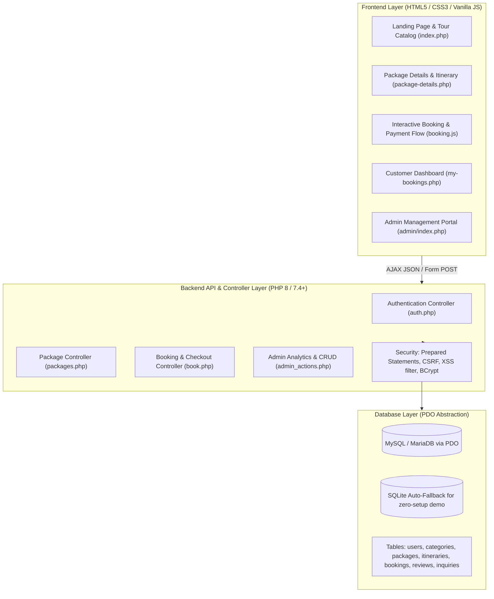

# Implementation Plan: Wanderlust - Tour & Travel Management System (PHP, MySQL, HTML, CSS, JS)

Build a complete, modern, academic-grade **Tour & Travel Management System** ("Wanderlust") with HTML5, CSS3, Vanilla JavaScript, and PHP with MySQL/SQLite database backend. The codebase is designed specifically to make it easy for the student to explain frontend, backend, database design, security, and workflows to their faculty.

---

## 1. System Architecture Overview



---

## 2. Key Modules & Features

### A. Frontend Layer (HTML5, Modern CSS3, Vanilla JavaScript)
- **Design System (`assets/css/style.css`, `assets/css/admin.css`)**:
  - Curated travel color palette: Deep Oceanic Navy (`#0A192F`), Sunset Coral (`#FF6B6B`), Golden Amber (`#FFB703`), Mint Teal (`#2EC4B6`), Crisp Off-White (`#F8F9FA`).
  - Glassmorphism navigation bar with blur effect, dynamic hero search banner with autocomplete.
  - Interactive category filter tabs (Adventure, Honeymoon, Cultural, Beach, Safari, Luxury).
  - Responsive cards with badges ("Best Seller", "20% OFF", "Eco-Tour"), hover scale effects, star rating displays.
- **Client-Side Dynamics (`assets/js/main.js`, `assets/js/booking.js`, `assets/js/admin.js`)**:
  - Live search & multi-attribute filter (price slider, duration, category) without full page reload.
  - Interactive multi-step booking modal (Step 1: Date & Guests $\rightarrow$ Step 2: Custom Add-ons & Insurance $\rightarrow$ Step 3: Mock Payment $\rightarrow$ Step 4: Instant Confirmation & Printable Voucher).
  - Review rating input with interactive stars.
  - Form validation with real-time feedback (Regex for email, phone, password strength).

### B. Backend Layer (Clean, Modular PHP)
- **Database Abstraction (`config/db.php`)**:
  - Connects to MySQL/MariaDB (standard for XAMPP `localhost`, `root`, blank password, DB `travel_db`).
  - Auto-initializes tables and seeds rich initial packages if database is empty.
  - Built-in SQLite fallback mode so the project runs immediately with zero configuration.
- **Session & Role Authentication (`includes/auth_check.php`, `api/auth.php`)**:
  - Customer vs Admin role validation.
  - Secure password hashing using `password_hash($password, PASSWORD_BCRYPT)` and `password_verify()`.
  - Session hijacking protection with `session_regenerate_id()`.
- **Tour Catalog & Details API (`api/packages.php`)**:
  - Fetch packages, filter by price/category/search, get package details with day-wise itinerary.
- **Booking Engine (`api/bookings.php`)**:
  - Validates seat availability, calculates total price including taxes and custom add-ons.
  - Generates unique Booking Reference ID (e.g. `WL-2026-8942`).
  - Updates package booking count and customer reservation history.
- **Admin Management & Analytics (`admin/`)**:
  - KPI Summary Cards: Total Revenue, Total Bookings, Active Tours, Customer Inquiries.
  - Chart visualization (Monthly sales and top destinations).
  - Package CRUD (Create new tour, Edit details/pricing/images, Delete/Archive).
  - Booking Management (Approve, Confirm, Cancel, Mark Completed).
  - Inquiry inbox to read and resolve messages from contact form.

### C. Faculty Presentation & Viva Defense Toolkit
- **`FACULTY_EXPLANATION_GUIDE.md`**:
  - Detailed cheat-sheet written specifically for the student to explain to the faculty member ("mam").
  - 10 common Viva questions with crisp answers (e.g., "Why PDO over mysqli?", "How do you prevent SQL injection?", "Explain how password hashing works in PHP", "Explain the 3-tier architecture of this project").
  - Code reference map linking exact file names and line numbers to functional concepts.
- **`PROJECT_DOCUMENTATION.md`**:
  - Complete project report format (Abstract, System Requirements, Scope, ER Diagram, Data Dictionary, Test Cases).
- **`database.sql`**:
  - Ready-to-import MySQL dump with table structure, foreign keys, and 8+ realistic travel packages.

---

## 3. Directory Structure

```
wanderlust-travel/
├── admin/                     # Admin Portal
│   ├── index.php              # Admin Dashboard & Analytics
│   ├── packages.php           # Tour Packages CRUD Management
│   ├── bookings.php           # Booking Requests & Status Updates
│   ├── inquiries.php          # Contact Messages / Inquiries
│   └── login.php              # Admin Authentication
├── api/                       # REST-like PHP JSON Backend APIs
│   ├── auth.php               # Login, Register, Logout
│   ├── packages.php           # Package list & details
│   ├── bookings.php           # Create booking, get user bookings
│   ├── reviews.php            # Add/Get reviews
│   └── contact.php            # Contact form submission
├── assets/                    # Static Assets
│   ├── css/
│   │   ├── style.css          # Main Frontend CSS Design System
│   │   └── admin.css          # Admin Portal Modern Styles
│   ├── js/
│   │   ├── main.js            # UI interactions, search, filter
│   │   ├── booking.js         # Multi-step checkout & payment
│   │   └── admin.js           # Admin charts & modal handlers
│   └── images/                # High quality optimized travel images
├── config/
│   └── db.php                 # PDO Database Connection & Auto-Setup
├── includes/                  # Reusable PHP Components
│   ├── header.php             # Navigation & Header
│   ├── footer.php             # Footer & Modals
│   └── auth_check.php         # Session verification middleware
├── database.sql               # Ready-to-import MySQL Database
├── index.php                  # Public Home Page & Tour Catalog
├── package-details.php        # Detailed Package & Itinerary View
├── my-bookings.php            # Customer Bookings & Voucher View
├── contact.php                # Contact Us & Support Page
├── about.php                  # About Us & Company Story
├── login.php                  # Dedicated Login / Signup Page
├── FACULTY_EXPLANATION_GUIDE.md # Viva & Faculty Presentation Guide
└── PROJECT_DOCUMENTATION.md   # Complete Project Report
```

---

## 4. Verification Plan

### Automated & Manual Verification
1. **PHP Syntax & Logic Check**: Verify all `.php` files for clean syntax without errors.
2. **Database Auto-Seeding Test**: Ensure database tables (`users`, `categories`, `packages`, `itineraries`, `bookings`, `reviews`, `inquiries`) create automatically and load realistic data.
3. **Frontend UI & Responsive Verification**:
   - Check landing page, package cards, filters, search bar, modals.
   - Test booking checkout flow with live price calculation and voucher generation.
   - Test customer login and registration flow.
   - Test admin login (`admin` / `admin123`) and package/booking management.
4. **Faculty Guide Completeness**: Ensure the explanation guide covers every possible question the professor/faculty could ask.
